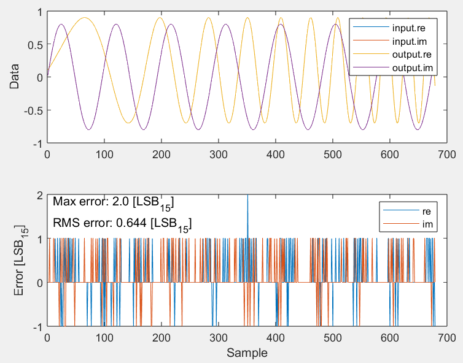
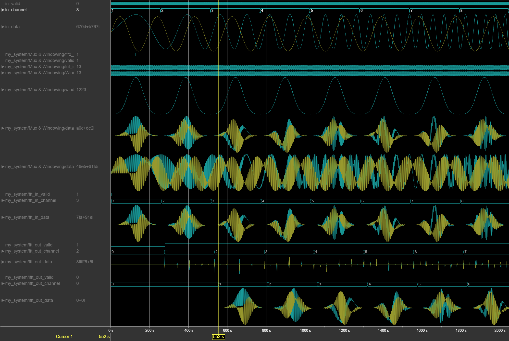
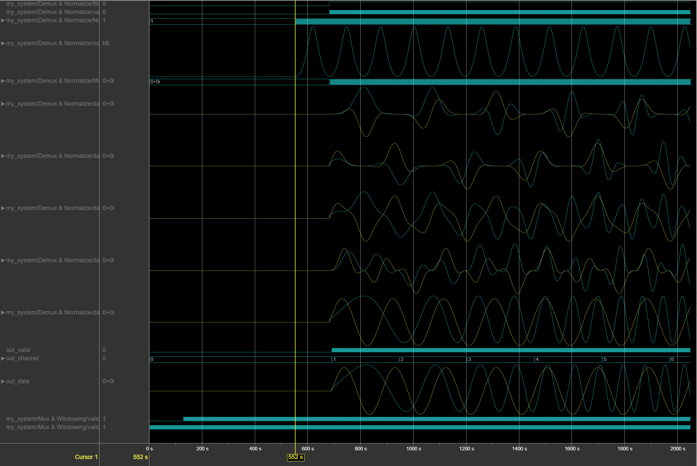
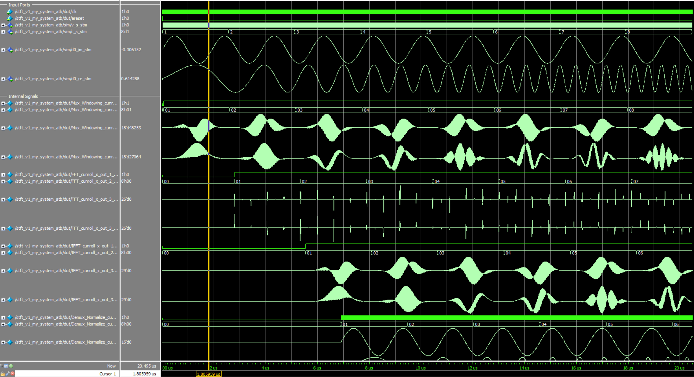
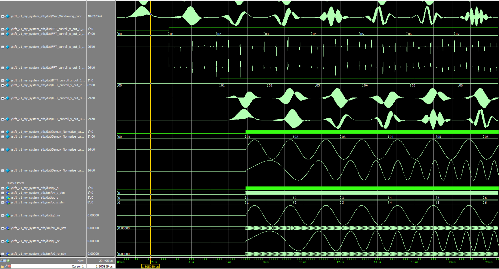

# dspba_stft

## Огляд репозиторія

* `stft_v1.mdl` - модель
* `setup_stft.m` - скрипт з конфігурацією (автоматично запускається при запуску симуляції в Simulink)
* `postprocess_stft.m` - скрипт для обрахунку похибки (автоматично запускається при завершенні симуляції в Simulink)
* `run_sim.do` - cкрипт для запуску симуляції в Questa / ModelSim
* `quartus/stft_v1_my_system.qpf` - проєкт Quartus

## Зауваження до реалізації

* **Підсистеми виконані маючи на увазі комплексний сигнал на вході та на виході.**
При роботі з виключно реальними сигналами є додаткове поле для оптимізації: два реальних сигнали можуть бути
скомбіновані в один комплексний на вхід FFT, і потім можуть бути розділені для обробки в частотній області за
допомогою відносно нескладних математичних перетворень. Такі перетворення не ставилися на меті при розробці
моделі.
* **В реалізації використовуються IP-ядра FFT/IFFT із `subchannels=2`**. Інший варіант реалізації полягав би
у використанні додаткових FIFO щоб розділити канали в часі і робити FFT/IFFT перетворення по черзі.
Це дозволило б зменшити кількість пам'яті використану FFT/IFFT, але ціною додаткової пам'яті ззовні, тому,
на перший погляд, цей варіант не дасть суттєвої різниці у використаних ресурсах.
* **Система працює виключно із Fclk/Fsamp=2**, оскільки FFT ядро потребує неперервний блок valid довжиною вікна
на вході.
* **В реальній системі може знадобитись подвійний bit reversal** щоб зробити обробку в частотній області зручнішою.
BitReverse IP-ядро також вирішує проблему попереднього пункту (дозволяючи працювати також із Fclk/Fsamp < 2), оскільки буферизує дані.
* **Під час процесингу в моделі збільшується resolution cигналів для того щоб не втратити кількість ефективних бітів після обробки**.
Вхідний сигнал формату Q1.15 розширюється до Q1.17 при накладенні вікна (фактор нормалізації досягає значення 2.8, тобто при накладенні вікна втрачається
~1.5 біта ефективного resolution). Після FFT роздільна здатність додатково збільшується на sqrt(Nfft_log2) щоб компенсувати round-off noise
FFT в fixed point. Після IFFT роздільна здатність зменшується до Q1.17, та після нормалізації повертається до Q1.15. Велика ширина регістрів IFFT 
неефективно використовує 18х18 апаратні перемножувачі в обраній архітектурі Cyclone 10 LP,
але вибір був зроблений на користь збереження точності результуючого сигналу.
* **Для коефіцієнтів вікна та нормалізації використовуються LUT довжиною Nfft/2+1 та Nfft/4+1 відповідно**, де Nfft - довжина вікна.
Для великого Nfft ефективнішим може бути генерувати коефіцієнти за допомогою CORDIC або математичних перетворень, аніж використовувати LUT.
Формати даних LUT - UQ0.17 та UQ1.17 відповідно. 
* **Коефіцієнт нормалізації збережений як (norm_factor-1)** що економить 1 біт ширини LUT. У floating point це також мало би додаткову перевагу
в точності, оскільки обрахунок формату a*(1+b) в загальному вигляді втрачає як мінімум 1 біт мантісси в порівнянні з a*b + a.
* **В найпершій версії для ліній затримки використовувались Enabled Delay Line, але вони були замінені на FIFO**, оскільки FIFO використовує апаратні
блоки пам'яті.

## Результати
### Обрахунок похибки

### Logic Analyzer

### RTL cимуляція

